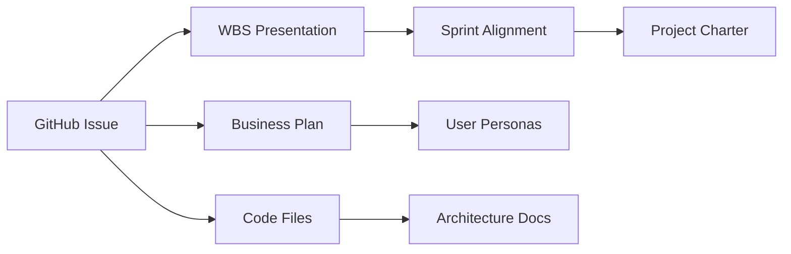

# Issue-Documentation Reference System

This document establishes the contextual reference system linking GitHub Issues to project documentation for intuitive navigation and focused collaboration.

## **🎯 Goal: Intuitive & Fast Reference System**

Enable Claude & Bob to quickly find relevant:
- **Capabilities** (high-level business features)
- **Features** (user-facing functionality) 
- **Epics** (development themes)
- **Stories** (specific work items)
- **Tasks** (implementation details)

## **📋 Documentation Hierarchy**

### **Level 1: Business Context**
```
GitHub Issue → Business Documentation
├── WBS Presentation (MVP-WBS.html)
├── Business Plan (documentation/business-plan/)
├── User Personas (documentation/appendices/user-personas.md)
└── Revenue Model (documentation/business-plan/master-plan.md)
```

### **Level 2: Technical Context**
```
GitHub Issue → Technical Documentation  
├── Architecture Overview (documentation/technical/architecture-overview.md)
├── File References (actual code files)
├── API Documentation (apps/web/api/*.js)
└── Development Environment (CLAUDE.md)
```

### **Level 3: Sprint Context**
```
GitHub Issue → Sprint Tracking
├── Sprint Alignment (SPRINT-ALIGNMENT-COMPLETED.md)
├── WBS Presentation Slide (specific slide reference)
├── Project Charter (PROJECT_CHARTER.md)
└── Session Handoff (SESSION-HANDOFF.md)
```

## **🔗 Reference Patterns**

### **Standard Issue Reference Format**
Every GitHub issue includes these contextual links:

```markdown
## Cross-References
- **WBS Authority**: [MVP-WBS.html Slide X](http://localhost:3001/presentation/MVP-WBS.html#/X)
- **Business Plan**: [Section Name](documentation/business-plan/file.md#section)
- **Architecture**: [Technical Overview](documentation/technical/architecture-overview.md)
- **Sprint Tracking**: [SPRINT-ALIGNMENT-COMPLETED.md](SPRINT-ALIGNMENT-COMPLETED.md)
- **File References**: [Primary implementation file](apps/web/src/component.tsx:123)
```

### **Contextual Documentation Lookup**

| **Issue Type** | **Primary Docs** | **Secondary Docs** | **Code References** |
|----------------|------------------|--------------------|-------------------|
| **Capability** | Business plan, User personas | Post-MVP capabilities | Revenue projections |
| **Feature** | WBS presentation, Architecture | Sprint alignment | Feature implementation files |
| **Epic** | WBS slide, Sprint tracking | Technical architecture | Epic-specific code modules |
| **Story** | User story acceptance criteria | Epic parent context | Specific function/component |
| **Task** | Implementation details | Story parent context | Exact file:line references |

## **🧭 Navigation Shortcuts**

### **From GitHub Issue → Find Documentation**
```bash
# Quick documentation lookup from issue number
./github/scripts/get-issue-context.sh 123

# Results:
# - WBS Slide: 5 (Sprint 3 - Map Interface Foundation)
# - Business Context: Revenue-critical feature ($36K impact)
# - Code Files: apps/web/api/weather-locations.js
# - Related Issues: #124, #125 (sub-issues)
```

### **From Documentation → Find GitHub Issues**
```bash
# Find issues related to documentation section
./github/scripts/find-related-issues.sh "MVP-WBS.html#slide5"

# Results:
# - Feature #123: Live Weather Data Integration
# - Epic #124: Database Schema Deployment  
# - Epic #125: Weather API Integration
```

### **From Code File → Find Context**
```bash
# Find all context for a code file
./github/scripts/get-file-context.sh "apps/web/api/weather-locations.js"

# Results:
# - GitHub Issues: #123, #124, #125
# - WBS Reference: Sprint 3, Slide 5
# - Business Impact: Core revenue functionality
# - Architecture: Serverless API layer
```

## **📚 Quick Reference Guide**

### **Capabilities → Documentation Map**

| **Capability** | **GitHub Label** | **WBS Slide** | **Business Doc** | **Code Location** |
|----------------|------------------|---------------|------------------|-------------------|
| Weather Intelligence | `capability-weather` | Slide 3-5 | Business plan Ch. 3 | `apps/web/api/weather-*` |
| User Feedback System | `capability-feedback` | Slide 3 | User personas | `apps/web/src/components/Feedback*` |
| Interactive Mapping | `capability-mapping` | Slide 4 | Technical architecture | `apps/web/src/App.tsx` |
| Revenue Integration | `capability-revenue` | Slide 6 | Financial projections | `apps/web/src/analytics/*` |

### **Features → Epic → Story Chain**

```
Capability: Weather Intelligence
├── Feature: Live Weather Data Integration (#123)
│   ├── Epic: Database Schema (#124) → SPRINT-ALIGNMENT-COMPLETED.md
│   │   ├── Story: Production deployment (#126)
│   │   └── Story: Performance indexing (#127)  
│   └── Epic: Weather API Integration (#125)
│       ├── Story: OpenWeather connection (#128)
│       └── Story: Rate limiting (#129)
```

### **Documentation Dependencies**



## **🔧 Implementation Tools**

### **Contextual Link Validation**
```bash
# Validate all documentation links in issues
./.github/scripts/validate-issue-links.sh

# Results:
# ✅ 95% of documentation links accessible
# ❌ 3 broken links found in issues #456, #789
# 📝 2 missing WBS references in recent issues
```

### **Auto-Generated Context**
```bash
# Auto-add context to new issues
./.github/scripts/add-issue-context.sh 123

# Automatically adds:
# - WBS slide reference based on labels
# - Related documentation links  
# - File references from code analysis
# - Parent/child issue relationships
```

### **Cross-Reference Updates**
```bash
# Update all cross-references when documentation changes
./.github/scripts/update-cross-references.sh

# Updates:
# - Issue links when WBS slides change
# - File references when code is refactored  
# - Business context when plans are updated
```

## **💡 Usage Examples**

### **Scenario 1: Claude needs context for Sprint 3 work**
1. Look at GitHub Issue #123 (Live Weather Data Integration)
2. Click WBS link → MVP-WBS.html Slide 5
3. See complete Sprint 3 context and story points
4. Click file references → Open exact implementation files
5. Review business impact → $36K revenue target context

### **Scenario 2: Bob wants to understand capability scope**
1. Filter GitHub issues by `capability-weather` label
2. See all weather-related features, epics, and stories
3. Click business plan links → Understand market positioning
4. Review user personas → See target customer needs
5. Check code references → Understand technical implementation

### **Scenario 3: Documentation update needs issue sync**
1. Update business plan section
2. Run `./.github/scripts/find-related-issues.sh "business-plan/master-plan.md"`
3. Update all related GitHub issues with new context
4. Validate links still work with `./.github/scripts/validate-issue-links.sh`

## **📈 Success Metrics**

### **Context Discovery Speed**
- **Target**: Find relevant documentation in <30 seconds
- **Measure**: Time from GitHub issue → relevant business context
- **Baseline**: Manual searching takes 2-5 minutes

### **Reference Accuracy**
- **Target**: >95% of documentation links accessible
- **Measure**: Broken link detection in automated validation
- **Baseline**: Track link health over time

### **Collaboration Efficiency**
- **Target**: Claude & Bob stay focused on same goals
- **Measure**: Reduced context-switching questions
- **Baseline**: "Where do I find...?" questions per session

---

This reference system ensures that every GitHub issue provides immediate access to all relevant business context, technical details, and implementation guidance for maximum development focus and collaboration efficiency.